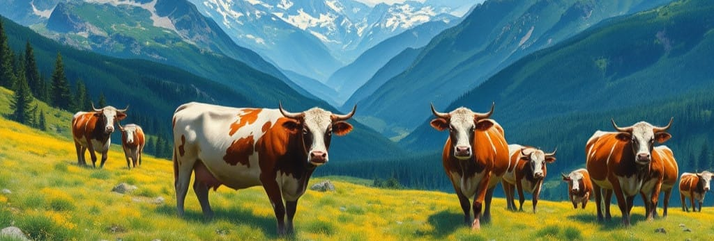

# Milking the Data

## Milk Production Prediction 
The Project Goal is to build an Artificial Neural Network (ANN) to accurately predict the average milk yield of cows based on environmental conditions (temperature, humidity, cold stress, precipitation) and lactation cycle information (lactation number, calving date, first record date). 

1. Data Exploration

The dataset has been extracted from the milk record database of the Braunvieh-CH breeding organisation, from [(Zenodo record)](https://zenodo.org/records/3962046) (Duruz, S., & Flury, C. (2020). The Rights of the dataset is cc0-1.0 icon Creative Commons Zero v1.0 Universal, making it freely usable without restriction. The dataset meets encoding to UT-8 standard. 

The dataset encompasses 20,000 cows and includes 10 variables, therefore represented as a DataFrame with 20,000 rows and 10 columns. The data spans a period from years 2000 to 2015. The provided dataset contains information on the following: 

cow and lactation cycle: lactation number, date of calving, date of first record of calv in the alp, average quantity of milk (measured in kilograms).

Environmental conditions: Temperature Humidity Index (THI) averaged over 3 and 30 days, Cold Stress Index (CSI) averaged over 3 and 30 days, precipitation during Spring.

The average quantity of milk is the defined target column ("Y") as the objective is to predict future milk production.

There were 41 null values found which adjusted the DataFrame down from 20,000 to 19,959 rows, and 10 columns. Based on the adjusted DataFrame of non-missing values, the following observations were made of the histogram of the target column ("Y") of the distribution of Average Milk Production over the three milk records:
 - The distribution is positively skewed to the right:
 - as a smaller number of data points extend further to the right side of the x-axis, creating a longer tail; 
 - and since the average milk yield for all cows is 15.92 kg which is more than the median (middle) milk yield of 15.6 kg. 
 - The most frequently produced milk production value (mode) of any one cow is 14.6 kg.
 - The standard deviation of 4.08 kg suggests there is not a large variability in milk production among the cows
 - The data is relatively spread out with a wide range of milk production values from 3.5 kg to 40.37 kg per cow
 - Only 1 cow in the dataset had the lowest milk production of 3.5 kg being the outlier at the lower end of the distribution 
 - Only 2 cows in the dataset had the highest milk production of 40.37 kg being the outliers at the higher end of the distribution
 - 25% of the cows (4,981) produced less than 13.07 kilograms of milk.  
 - 50% of the cows (10,000) produced less than 15.60 kilograms of milk, and 50% (10,000) produce more.
 - 75% of the cows (14,992) produced less than 18.50 kilograms of milk.
 - 13,753 cows (approximately 68.9%) fall within one standard deviation of the mean milk production.
 - 19,067 cows (approximately 95.5%) fall within two standard deviations of the mean milk production.
 - 19,865 cows (approximately 99.53%) fall within 3 standard deviations of the mean milk production.

Based on these observations, it can be inferred that a majority of the cows in the dataset have an average milk yiled between 15 - 20 kgs over the three milk records. An investigation of the cow (ID 3844) with the exceptionally low milk yiled of 3.5 kg and an investigation of the two cows (ID 3923 and ID 6922) with the exceptionally high milk yield of 40.37 kg can be carried out by calculating and analyzing a correlation matrix to glean insights into the potential relationships between various factors and milk production. 

In summary of the understanding a correlation matrix, 
- correlation coefficients range from -1 to 1.
- A value of 1 indicates a perfect positive correlation (as one variable increases, the other increases proportionally).
- A value of -1 indicates a perfect negative correlation (as one variable increases, the other decreases proportionally).
- A value of 0 indicates no correlation between the variables.

We have gleaned the following insights from the correlation matrix calculated and graphed in our Jupyter Notebook. The correlation matrix provides valuable insights into the potential relationships between various factors and milk production:  

Diagonal: The diagonal of the matrix (from top-left to bottom-right) shows correlations of each variable with itself, which are always 1.00.

Lactation number (lact_num):
Has a weak positive correlation with avg_thi3 (0.24). This suggests that cows with higher lactation numbers (likely older cows) might have slightly higher average THI3 values.

Average milk production (avg_milk):
Shows strong negative correlations with avg_thi3 (-0.33), avg_csi3 (-0.17), avg_thi30 (-0.27), and date_diff (-0.52). This indicates that cows with higher average milk production tend to have lower values for these variables.
A positive correlation with avg_precspring (0.16) suggests that higher average spring precipitation might be associated with slightly higher milk production.

temperature humidity index, averaged over 3 days before the records, average over the 3 records taken in the alp (avg_thi3):
Has strong negative correlations with avg_csi3 (-0.83), avg_thi30 (-0.77), and date_diff (0.55). This suggests that avg_thi3 is strongly related to these variables.

Cold stress index, averaged over 3days before the records, average over the 3 records taken in the alp (avg_csi3):
Shows high positive correlations with avg_thi30 (0.69) and avg_thi3 (-0.83). This indicates a strong relationship between these cold stress indices.

Cold stress index, averaged over 30 days before the records, average over the 3 records taken in the alp (avg_csi30):
Also shows high positive correlations with avg_thi3 (-0.77) and avg_csi3 (0.69).

Average precipitation during spring (April to July) of the year in which alping takes place, in mm/month (avg_precspring):
Has a moderate positive correlation with date_diff (0.28). This suggests that cows with longer intervals between calving and the start of the alping season might have experienced higher average spring precipitation.

The number of days from the date of calving (calv_date) to date of the first record taken in the alp (usually shortly after the arrival of the animal in the alp) date_diff:

Shows a strong positive correlation with avg_thi3 (0.55), avg_csi3 (0.33), and avg_csi30 (0.42). This suggests that cows with longer intervals between calving and the start of the alping season tend to have higher cold stress indices.

calv_month:

Shows strong positive correlations with avg_thi3 (0.68), avg_csi3 (0.43), avg_csi30 (0.54), and date_diff (0.66). This suggests that cows calving in certain months might experience higher cold stress.

calv_day_of_month, alp_month, alp_day_of_month: These variables show relatively weak correlations with other variables.

The correlation matrix mostly highlights potential associations between milk production, cold stress indices, calving season, and the interval between calving and the start of the alping season. Based on that:

the potential reasons for the cow (ID 3844) producing only 3.5 kg of milk based on the provided variables:
Environmental Stress: 
- High Temperature and Humidity (THI): While the given THI of 59.18 might not seem excessively high, prolonged exposure to high temperatures and humidity can negatively impact milk production.
- Cold Stress: The high cold stress index (CSI) values (1095.81 and 1040.56) suggest that the cow might have been exposed to significant cold stress, which can reduce milk production.
- Heat Stress: Although less likely with the given THI, if the cow experienced heat stress during lactation, it could have significantly reduced milk production.
- Calving Interval:
The 277-day interval from calving to the first record might suggest a shorter than ideal dry period, which could have negatively impacted subsequent lactation.

the potential reasons for the cows (ID 3923 and ID 6922) with the exceptionally high milk yield of 40.37 kg based on the provided variables:
Optimal Environmental Conditions:
- Mild Climate: The relatively low THI values (44.27) suggest a comfortable temperature and humidity environment during the recording period. This can minimize heat stress and optimize milk production.
- Moderate Cold Stress: While cold stress can negatively impact milk production, the CSI values (1088.68 and 1140.58) might indicate a moderate level of cold stress, which could potentially stimulate feed intake and milk production in some breeds.
- Adequate Forage: The average spring precipitation of 182.88 mm/month suggests sufficient rainfall for good pasture growth, providing the cow with ample high-quality forage for milk production. 
Short Calving-to-Alping Interval:
The short interval of 11 days between calving and the start of the alping period might have positively influenced milk production in this particular cow. However, this can vary depending on the individual cow and breed.

Correlation does not imply causation. Further analysis, such as regression analysis, would be needed to determine the causal relationships between these variables. Notwithstanding, we don't know about the specifics of the cows health, nutrition, feeding management, reproduction, genetics, and the like, i.e. Milk production could vary significantly among individual cows due to genetic factors, age, breed, and previous lactation history and we don't have that data. The provided data represents only a snapshot of the cow's condition and environment.  To determine the specific reason for low or high milk production in cows in this dataset, it would be necessary to further investigate into the cow's medical history, feeding records, and environmental conditions more thoroughly. Also, a more comprehensive understanding would require long-term monitoring of various factors, including feed intake, body condition score, and reproductive health.

2. Data Preprocessing:

Data Cleaning:
Handle missing values and outliers.
Encode categorical features if necessary.
Feature Engineering.
Normalize or standardize numerical features.
Prepare the data for training and testing.

Addendum No.1: References/Citations
Duruz, S., & Flury, C. (2020). Milk production and environmental conditions of mountain-pastured Braunvieh cows between 2000 and 2015 [Data set]. Zenodo. https://doi.org/10.5061/dryad.z612jm68g
 

